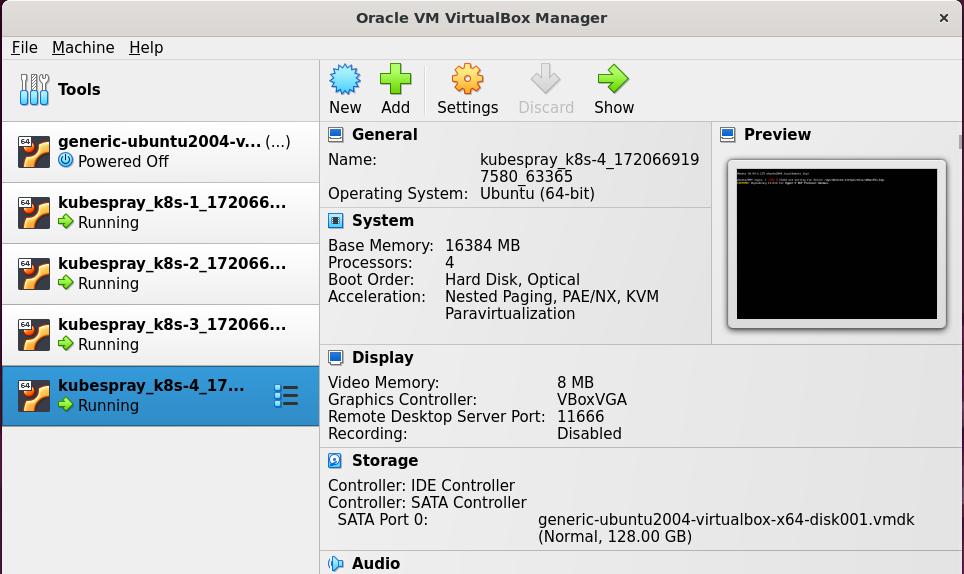

---
# Kubernetes 환경 구성

kubespray + vagrant + virtualbox on Ubuntu 22.04    

## kubespray 환경 구성에 필요한 도구 설치  
```
1. VirtualBox 설치  ( 버전 : 7.0.18r162988 )
2. Vagrant 설치 ( 버전 : 2.4.1 ) 
```

## Kubespray 설치
```
$ mkdir -p  $HOME/work/
$ cd $HOME/work 
$ git clone https://github.com/kubernetes-sigs/kubespray.git 
$ cd kubespray 
$ git checkout **v2.25.0**                 ← kubernetes verison 1.29.5

참고 : https://github.com/kubernetes-sigs/kubespray/releases/tag/v2.25.0
```

| Ansible Version | Python Version |
| --- | --- |
| >= 2.16.4 | 3.10-3.12 |

## ansible 환경 구성
```
$ cd $HOME/work 
$ VENVDIR=kubespray-venv 
$ KUBESPRAYDIR=kubespray 
$ python3 -m venv $VENVDIR 
$ source $VENVDIR/bin/activate 
$ cd $KUBESPRAYDIR 
$ pip install -U -r requirements.txt  
```
$ vagrant up   


참고 :  vagrant halt, vagrant suspend, vagrant destroy -f    ← vagrant 기본 명령어 숙지.   
중요 : virtualBox와 Vagrant 설치 후 “vagrant up” 명령 시 vm이 정상 동작하는 충분히 테스트 한다. 

위의 그림과 유사하게 설치되었다면 ssh로 접속하여 동작 여부 확인 
```
$ vagrant ssh k8s-1
```

```
#### vagrant 전체 확인
$ vagrant global-status
dsi3@dsi3-k8s:~$ vagrant global-status
id       name         provider   state   directory
-------------------------------------------------------------------------------
f028176  w-k8s-master virtualbox running /home/dsi3/work/k8s-vm
2185c18  web-1        virtualbox running /home/dsi3/works/k8s-vm/kubespray_web
296502f  web-2        virtualbox running /home/dsi3/works/k8s-vm/kubespray_web
995e4fc  web-3        virtualbox running /home/dsi3/works/k8s-vm/kubespray_web
24906bd  was-1        virtualbox running /home/dsi3/works/k8s-vm/kubespray_was
a16f4b9  was-2        virtualbox running /home/dsi3/works/k8s-vm/kubespray_was
352203b  was-3        virtualbox running /home/dsi3/works/k8s-vm/kubespray_was

The above shows information about all known Vagrant environments
on this machine. This data is cached and may not be completely
up-to-date (use "vagrant global-status --prune" to prune invalid
entries). To interact with any of the machines, you can go to that
directory and run Vagrant, or you can use the ID directly with
Vagrant commands from any directory. For example:
"vagrant destroy 1a2b3c4d"
```

네트워크 관련 에러 발생 시 kubeconfig가 없는 경우이니 아래 명령어로 해결 
```
$ mkdir -p $HOME/.kube 
$ sudo cp -i /etc/kubernetes/admin.conf $HOME/.kube/config 
$ sudo chown $(id -u):$(id -g) $HOME/.kube/config  
$ kubectl get pod -A
```

---
---
# OpenToFu를 이용한 어플리케이션 자동 설치 
참조 사이트 : https://opentofu.org/docs/


### 환경 
```
OS: Ubuntu 20.04
```

## 1. OpenToFu 설치 
```
참조 : https://opentofu.org/docs/intro/install/ 
$ sudo snap install --classic opentofu 
$ tofu -install-autocomplete
# restart bash 
```
## 2. Helm 설치 
```
$ sudo snap install --classic helm
```

## 3. OpenToFu 기본 사용 법 
```
$ tofu init
$ tofu plan
$ tofu apply
```

## 4. 현재 구성 
```
# tofu workspace 
tofu workspace :
  default   
  web-cluster  
  was-cluster

# kubernetes
dsi3@dsi3-k8s:~/works$ k config get-contexts
CURRENT   NAME                CLUSTER       AUTHINFO    NAMESPACE
          was-admin@cluster   was-cluster   was-admin
*         web-admin@cluster   web-cluster   web-admin
```
```
# workspec 생성
$ tofu workspace new [생성할 workspace 명]

# workspec 조회
$ tofu workspace list

# workspace 변경
$ tofu workspace select [변경할 workspace 명]
```

## 5. main.tf 
```
locals {
  k8s_context = "${terraform.workspace}"
  k8s_context_resolved = local.k8s_context == "web-cluster" ? "web-admin@cluster" : (
    local.k8s_context == "was-cluster" ? "was-admin@cluster" : local.k8s_context
  )
}
/* dev cluster 추가할 때
locals {
  k8s_context = "${terraform.workspace}"
  k8s_context_resolved = local.k8s_context == "web-cluster" ? "web-admin@cluster" : (
    local.k8s_context == "was-cluster" ? "was-admin@cluster" : (
      local.k8s_context == "dev-cluster" ? "dev-admin@cluster" : local.k8s_context
    )
  )
}
*/


# kubernetes provider
provider "kubernetes" {
  config_path     = "~/.kube/config"
  config_context   = local.k8s_context_resolved 
}

# Helm provider
provider "helm" {
  kubernetes {
    config_path     = "~/.kube/config"
    config_context   = local.k8s_context_resolved 
  }
}
```

